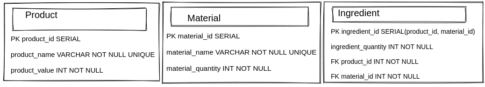

** Em desenvolvimento .. **

## Como executar a aplicação no estado atual:
Requisitos:
- docker e docker-compose
- java 17
- npm e node

1. Rodar o container com o banco SQL configurado utilizando os scripts da pasta /sql. comando:
`docker-compose up`

2. Acessar o diretório do backend (backend/quarkus-reactive-sql-client/)
comando:
`mvn quarkus:dev`

3. Acessar o diretório do frontend (frontend/react-autoflex/), instalar as dependências.
comando:
`npm install`
`npm start`

4. a aplicação ficará disponível em http://localhost:8080/ .

Nota: foi adicionada política de CORS ao backend em application.properties para rodar localmente.

### Estágio de desenvolvimento:
#### 1. Tabelas SQL
tabelas sql: 

1.1 [x]  Banco SQL - Tabelas

1.2 [x]  Banco SQL - Regras de negócio Tabelas

1.3 [x]  Banco SQL - Insert de dados para testes

1.4 [x]  docker-compose para banco de dados

#### 2. Backend

2.1 [x]  Backend - Build

2.2 [x]  Backend - endpoints Product

2.3 [x]  Backend - endpoints Material

2.4 [x]  Backend - endpoints Ingredient

2.5 [x]  Backend - exceptions

2.6 [ ] Backend - Testes [INCOMPLETOS, falta subir banco em memória]

2.7 [ ] docker-compose para backend

#### 3. Frontend

3.1 [x]  Frontend - Build

3.2 [x]  Frontend - Jquery

3.3 [x]  Frontend - Redux Provider

3.4 [x]  Frontend - API services

3.5 [x]  Frontend - Componente de navegação NavbarComponent

3.6 [ ] Frontend - Footer

3.7 [ ] Frontend - page Product (falta configurar ação de put(editar) e respectiva interface)

3.8 [ ] Frontend - page Material (falta configurar ação de put(editar) e respectiva interface)

3.9 [x]  Frontend - page Welcome ('/')

3.10 [x]  Frontend - component ProductCard

3.11 [ ] Frontend - component IngredientCard (falta configurar ação de put(editar) e respectiva interface)

3.12 [ ] Frontend - style (css)

3.13 [ ] some Frontend Tests (Cypress)

3.14 [ ] docker-compose para frontend

# Teste Prático - Autoflex

## Descrição do problema:

Uma indústria que produz produtos diversos, necessita controlar o estoque dos insumos (matérias-primas) necessárias para a produção dos itens que fabrica. Para isso será necessário o desenvolvimento de um sistema que permita manter o controle dos produtos e das matérias-primas que são utilizadas para a produção de cada produto.

Para o produto devem ser armazenados, além do código, o nome e o valor.

Para as matérias-primas, além do código, também devem armazenados o nome e quantidade em estoque. Obviamente, deverá ser feito a associação dos produtos e das matérias primas que o compõem, com as respectivas quantidades necessárias de cada matéria prima para produzir o produto.

Além da manutenção dos cadastros, deseja-se saber quais produtos (e quais quantidades) podem ser produzidos com as matérias-primas em estoque, e o valor total que será obtido com a produção sugerida pelo sistema.

A priorização de quais produtos devem ser sugeridos pelo sistema, deve ser pelos produtos de maior valor, uma vez que uma determinada matéria-prima pode ser utilizada em mais de um produto.

# Requisitos:

## - Requisitos não funcionais

RNF001 – O sistema deverá ser desenvolvido para a plataforma WEB, sendo possível a execução nos principais navegadores (Chrome, Firefox, Edge).

RNF002 – O sistema deverá ser construído utilizando o conceito de API, ou seja, separar o back-end do front-end.

RNF003 – As telas desenvolvidas no front-end devem utilizar os recursos de responsividade.

RNF004 – A persistência de dados deve ser realizada em Sistema Gerenciador de Banco de Dados, com a possibilidade de utilizar Postgres, MySql ou Oracle. Caso tenha instalado o Oracle, a sugestão é utilizá-lo.

RNF005 – O back-end (API) deve ser desenvolvido utilizando algum framework, como Spring, Quarkus ou similar. Caso você conheça Quarkus, a sugestão é que aplique já que é uma das tecnologias utilizadas no Autoflex.

RNF006 – O front-end pode ser desenvolvido utilizando qualquer linguagem ou framework que possibilite o atendimento dos requisitos. Caso você conheça React e Redux, a sugestão é que aplique já que são tecnologias utilizadas no Autoflex.

RNF007 – Tanto a codificação do back-end, front-end, tabelas e colunas do banco de dados devem ser desenvolvidas utilizando a língua inglesa.

## - Requisitos funcionais

RF001 – Desenvolver no back-end as funcionalidades CRUD para manter o cadastro de produtos.

RF002 – Desenvolver no back-end as funcionalidades CRUD para manter o cadastro de matérias primas.

RF003 – Desenvolver no back-end as funcionalidades CRUD para associar matérias-primas aos produtos.

RF004 – Desenvolver no back-end as funcionalidades para a consulta dos produtos que podem ser produzidos com as matérias-primas disponíveis em estoque.

RF005 – Desenvolver no front-end uma interface gráfica que possibilite realizar as operações CRUD para manter o cadastro de produtos.

RF006 – Desenvolver no front-end uma interface gráfica que possibilite realizar as operações CRUD para manter o cadastro de matérias primas.

RF007 – Desenvolver no front-end uma interface gráfica que possibilite realizar as operações CRUD para associar matérias-primas aos produtos. Não há a necessidade de ser uma tela separada, podendo ser inserida a interface no cadastro de produtos.

RF008 – Desenvolver no front-end uma interface gráfica que possibilite listar quais produtos (e quais quantidades) podem ser produzidos com as matérias-primas disponíveis em estoque.

## Desejável:

- Desenvolvimento de testes unitários para o back-end e para o front-end

- Desenvolvimento de testes de integração. Caso tenha conhecimento da tecnologia Cypress, a sugestão é utilizá-la já que utilizamos no Autoflex.

### Atenção 🚩

A entrega deste teste prático deverá ser da seguinte forma:

Postar os códigos publicamente em sua conta do GitHub e nos passar o link de acesso.

Opcionalmente, caso você consiga fazer o build da aplicação, poderá também informar o link de acesso.

Após o repasse dos códigos, é possível entrarmos em contato para agendarmos uma entrevista com nossa equipe técnica.

Boa sorte! 🍀
